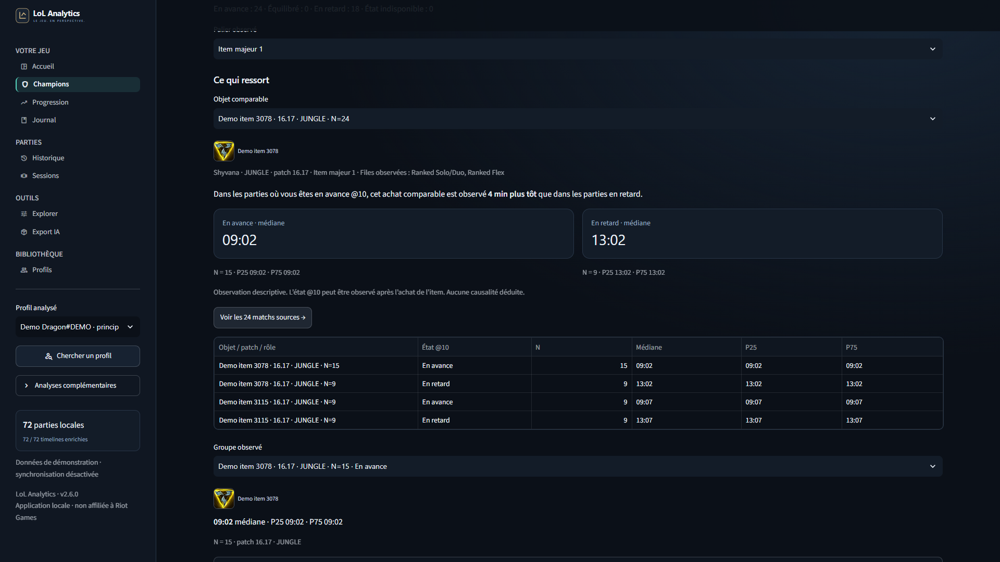
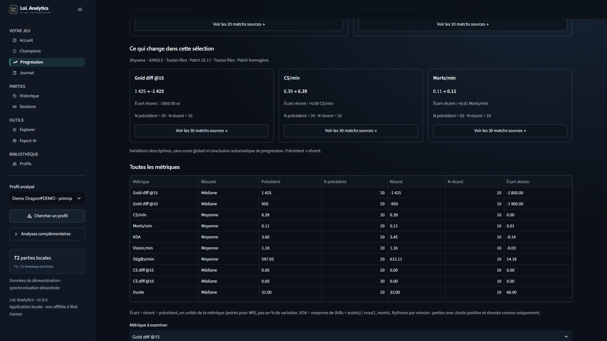
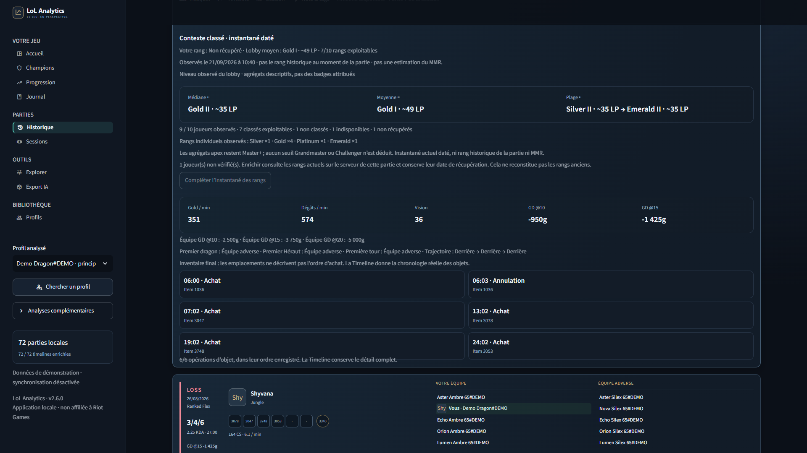

# LoL Analytics 2.6.0

**Your games, in perspective.** A local League of Legends workspace for personal match history, champion analysis and progression. Current stable release: **2.6.0**.

[](https://github.com/urattems/lol-analytics/actions/workflows/tests.yml)
[](https://www.python.org/downloads/)
[](LICENSE)

[Download](https://github.com/urattems/lol-analytics/releases/latest) · [User guide](docs/USER_GUIDE.md) · [Installation help](docs/FIRST_RUN.md)

Desktop-first, French interface. Your library stays in local SQLite. Each analytical observation shows its sample size and can lead back to the exact source games.

## Your personal analysis workspace

| Area | What you can do |
| --- | --- |
| Accueil, Historique and Sessions | Find games, review both teams, follow a session and inspect available Timelines. |
| Champions and Stuff & timings | Compare qualified item acquisitions on the same champion, role and patch, with medians, quartiles and exact sources. |
| Progression | Compare disjoint periods, inspect metric-specific sample sizes and keep patch changes explicit. |
| Dated rank context | Inspect observed personal and lobby ranks, median, mean, range and unavailable observations. |
| Journal | Keep private notes, tags and goals; revisit recurring players; preview a separately sanitized sharing format. |
| Profiles and imports | Switch isolated profile libraries and resume persistent imports through rate-limit waits. |
| Export IA | Download a full, filtered or session-specific bundle when you choose. No automatic AI upload. |







All screenshots use synthetic players and games.

## Windows: double-click and follow along

Download the [current release ZIP](https://github.com/urattems/lol-analytics/releases/latest), **extract everything** into a permanent writable folder, then double-click **INSTALLER.bat**. Do not run it inside the ZIP.

1. The launcher checks Python and prepares dependencies in its own `.venv`. If Python is missing, it asks before installing Python 3.13 for your Windows account with WinGet, or guides you to the official download.
2. Enter your complete Riot ID (`Name#TAG`), choose the actual LoL server and paste your own API key into the masked field. The assistant opens the [Riot Developer Portal](https://developer.riotgames.com/) when requested; it never asks for your Riot password.
3. Verify the account, confirm the main profile, and optionally import up to 20 recent games and create a desktop shortcut.
4. Click **Ouvrir LoL Analytics**. For later starts, use the shortcut or `start_lol_analytics.bat`. Keep the launcher window open while using the app.

Rerun `INSTALLER.bat` to renew a key. Existing settings are backed up locally before replacement; existing games are preserved. Windows 10/11 and 64-bit Python 3.11–3.13 with Tcl/Tk are supported by the launcher. Initial installation requires Internet. This is a guided source installation, not a signed standalone executable. [Detailed setup and troubleshooting](docs/FIRST_RUN.md).

## Try it without a Riot key

Double-click **start_demo.bat**, or choose **Essayer la démo sans clé** in the installer. The demo prepares 72 synthetic games, two profiles, invented annotations and example goals in a separate database. It does not edit your `.env` or replace your personal library. Imports are disabled; optional Data Dragon artwork can use the network.

Manual setup in Windows PowerShell:

```powershell
git clone https://github.com/urattems/lol-analytics.git
cd lol-analytics
python -m venv .venv
.venv\Scripts\python -m pip install -r requirements.txt
.venv\Scripts\python -m scripts.start_demo
```

Open [localhost:8502](http://localhost:8502). On Linux/macOS, use `python3` and `.venv/bin/python`. Windows is the primary desktop target; the CI also runs offline tests on Ubuntu.

## Bring your own history

The Windows installer configures personal mode. For manual setup, copy `.env.example` to `.env` only if `.env` does not already exist, then enter your own key, Riot ID and correct platform/routing region locally. The Riot ID tag is not the server. Use `start_lol_analytics.bat` or `python -m streamlit run app.py` from the configured environment.

Use **Synchroniser** for recent games and **Importer l’historique** for older available games. Imports are persistent jobs with explicit cancel/resume actions. Timeline and rank enrichment are separate actions. Browsing imported games does not automatically fetch Riot matches. Use **Profils** to import and review another profile without mixing its analysis with your main account.

## Privacy and honest limits

- Local SQLite, private settings and backups stay on your computer. Notes, settings and backups are not encrypted by the application.
- Exports require an explicit download. The AI bundle retains the analyzed profile’s Riot ID and match IDs, even though external players are aliased. Inspect it before sharing.
- Journal sharing is a separate reviewed format. Dates and annotations are opt-in, and annotations require separate consent. Redaction is not universal anonymity.
- Analytics describe your imported games: no MMR estimate, win prediction, hidden coaching score or causal advice. Missing values remain missing and small samples are labeled.
- Item timings require appropriate patch metadata and usable events. Final inventories are not purchase sequences. Dated ranks describe retrieval-time observations, not necessarily the rank when a match was played.
- Games under five minutes are excluded from analytical summaries by default; full exports retain them. API availability, key expiry and rate limits constrain imports.
- This is a local desktop app, not an authenticated multi-user hosted service. See [security guidance](SECURITY.md).

## Development

The application uses **Riot APIs → validated records → SQLite → Polars → Streamlit and Plotly**. Pure analytical calculations live in `analytics/`, persistence and clients in `core/`, and presentation in `pages/` and `ui/`.

```powershell
.venv\Scripts\python -m pytest -q
.venv\Scripts\python -m compileall -q app.py analytics config core pages ui scripts tests
.venv\Scripts\python -m pip check
.venv\Scripts\python -m scripts.check_environment
```

Tests use synthetic fixtures, temporary databases and HTTP mocks. CI is configured for Python 3.11, 3.12 and 3.13 on Windows and Ubuntu, on main pushes, pull requests and manual runs. See [contributing](CONTRIBUTING.md), the [user guide](docs/USER_GUIDE.md) and [changelog](CHANGELOG.md).

## License

Licensed under [MIT](LICENSE). Riot Games names, artwork and other assets remain the property of their respective owners and are not covered by the software license.

LoL Analytics isn't endorsed by Riot Games and doesn't reflect the views or opinions of Riot Games or anyone officially involved in producing or managing Riot Games properties. Riot Games, and all associated properties are trademarks or registered trademarks of Riot Games, Inc.
